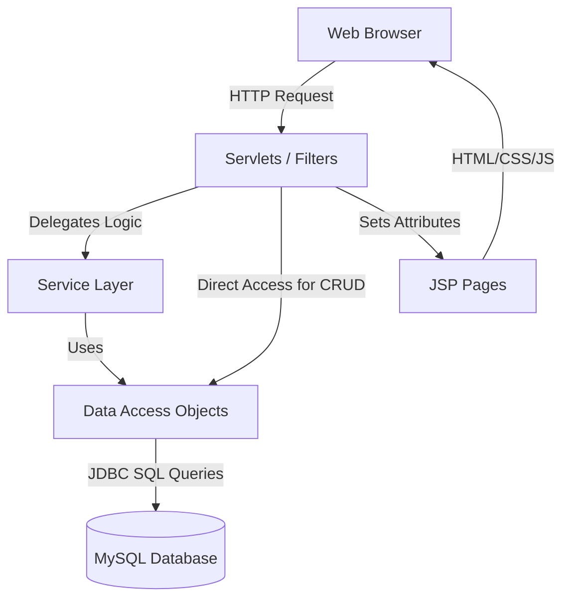
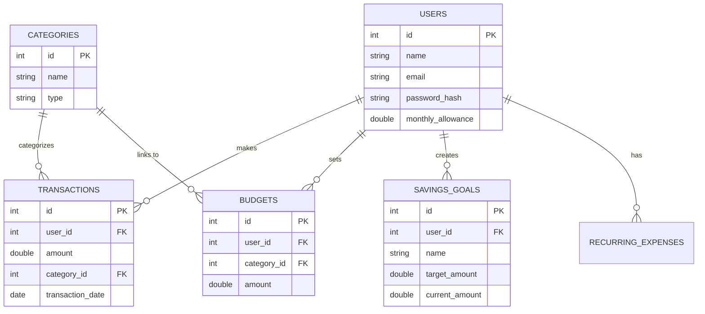
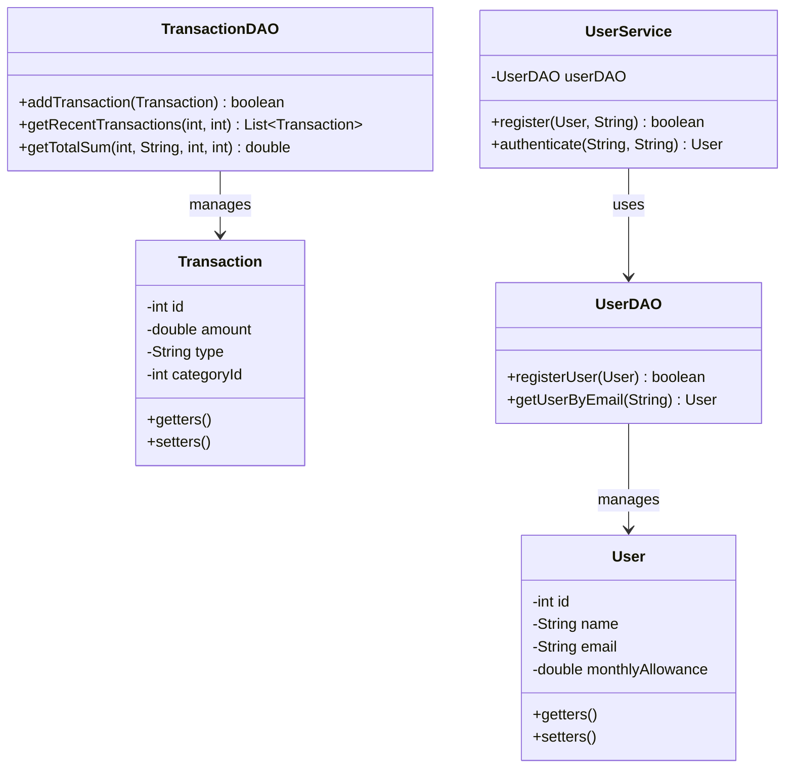

# SpendWise - Student Expense & Budget Manager

**SpendWise** is a professional, modern, feature-rich Student Expense Tracker web application built as a college-level software project. It is designed specifically for college students to track their daily expenses, monitor monthly allowances, set savings goals, and receive actionable financial insights.

## Project Objective

The goal of this project is to provide a complete, working financial management tool that goes beyond standard CRUD operations. It acts as a real-world fintech/productivity application where students can:
- Track daily income and expenses.
- Set category-specific budgets.
- Manage "Savings Goals" for high-ticket items.
- Check if they can afford an impulse purchase with the "Can I Afford It?" algorithm.
- View their financial health score and daily spending limits dynamically.

---

## Features

- **Robust Authentication:** Secure registration and login using SHA-256 password hashing.
- **Modern Dashboard:** A visually impressive overview of monthly allowance, remaining budget, and recent transactions.
- **Smart Budgets:** Set budgets for categories (e.g., Food, Transport) and get visual progress bars warning you when you exceed limits.
- **Savings Goals:** Track progress towards saving for a new phone, trip, or course.
- **"Can I Afford It?" Calculator:** An intelligent tool that analyzes remaining budget and upcoming recurring expenses to recommend whether a purchase is safe.
- **Analytics & Insights:** Automatically generates a financial health score and visualizes category spending using Chart.js.
- **Responsive UI:** Fully mobile-friendly interface with a premium SaaS look, using Bootstrap 5.

---

## Technology Stack

### Backend
- **Java 11+**
- **Java Servlets & JSP**
- **JDBC** (Java Database Connectivity)
- **MVC Architecture** (Model-View-Controller)
- **DAO Pattern** (Data Access Object)
- **Gson** (For AJAX JSON responses)

### Frontend
- **HTML5 & CSS3**
- **JavaScript** (For Chart.js and AJAX logic)
- **Bootstrap 5** (For responsive, modern UI components)

### Database
- **MySQL 8**

### Tools
- **Maven** (Dependency management & Build tool)
- **Apache Tomcat 9/10** (Application Server)

---

## Folder Structure

```
SpendWise/
├── src/main/java/com/spendwise/
│   ├── model/         # User, Transaction, Category, Budget, SavingsGoal, RecurringExpense
│   ├── dao/           # UserDAO, TransactionDAO, CategoryDAO, BudgetDAO, SavingsGoalDAO, etc.
│   ├── service/       # UserService (Business Logic)
│   ├── controller/    # RegisterServlet, LoginServlet, DashboardServlet, AnalyticsServlet, etc.
│   └── util/          # DBConnection, PasswordUtil, AuthFilter
├── src/main/webapp/
│   ├── assets/
│   │   └── css/       # style.css
│   ├── WEB-INF/       # web.xml
│   ├── index.jsp      # Landing Page
│   ├── login.jsp
│   ├── register.jsp
│   ├── dashboard.jsp
│   ├── transactions.jsp
│   ├── budgets.jsp
│   ├── savings.jsp
│   └── analytics.jsp
├── database/
│   └── schema.sql     # MySQL database structure & default categories
└── pom.xml            # Maven configuration file
```

---

## System Architecture Diagram



---

## ER Diagram (Entity Relationship)



---

## Class Diagram (Simplified)



---

## Java Concepts Demonstrated (For Viva/Report)

1. **Classes and Objects:** The entire application is built around objects (User, Transaction, Budget) mapped to real-world entities.
2. **Encapsulation:** All fields in `model` classes are `private`, accessed via public getters/setters to protect the integrity of the data.
3. **Abstraction & Interfaces:** The DAO pattern abstracts the database logic away from the Servlets. The controllers don't need to know *how* data is saved, only that `addTransaction()` works.
4. **Collections Framework:** Used extensively (e.g., `List<Transaction>`, `ArrayList`, `Map<String, Double>`) to retrieve data from ResultSets and aggregate it for the Analytics dashboard.
5. **Streams API (Java 8+):** Used in `AnalyticsServlet` to filter transactions and group them by category using `Collectors.groupingBy`.
6. **Exception Handling:** Try-catch blocks used universally in DAO classes to handle `SQLException` gracefully, ensuring the app doesn't crash on database timeouts.
7. **Date and Time API (Java 8+):** `LocalDate` is used to dynamically determine the current month and calculate the smart daily spending limit.
8. **Try-With-Resources:** Used in all JDBC connections to ensure `Connection`, `PreparedStatement`, and `ResultSet` are closed automatically to prevent memory leaks.
9. **Servlets & Filters:** `AuthFilter` intercepts requests to prevent unauthenticated users from accessing protected pages like the Dashboard.

## Setup Instructions

### 1. Database Setup
1. Open MySQL Workbench.
2. Run the `database/schema.sql` script to create the `spendwise_db` database and tables.
3. It will automatically insert default categories (Food, Transport, etc.).

### 2. Configure Credentials
1. Open `src/main/java/com/spendwise/util/DBConnection.java`.
2. Update the `USER` and `PASSWORD` static constants to match your local MySQL credentials.

### 3. Build and Run
1. Open the project in an IDE like **IntelliJ IDEA Ultimate** or **Eclipse (Enterprise Edition)**.
2. Ensure you have **Apache Tomcat (9 or 10)** configured in your IDE.
3. Let Maven download the required dependencies (`pom.xml`).
4. Run the project on the Tomcat Server.
5. Access the app at `http://localhost:8080/SpendWise/`.

### 4. Demo Path
1. Click **Get Started** on the landing page.
2. Register a new user with a Monthly Allowance (e.g., ₹15,000).
3. Log in.
4. Add a few transactions in the **Transactions** tab.
5. Set a budget in the **Budgets** tab.
6. Check the **Dashboard** for the *Smart Daily Limit* and test the *"Can I Afford It?"* modal.
7. View the visual charts in the **Analytics** tab.

---

## Future Scope
- Add robust PDF/CSV Export functionality for Reports using libraries like iText or OpenCSV.
- Implement Email Notifications (JavaMail API) for when a budget is exceeded.
- Expand gamification features to include point accumulation for staying under budget.
